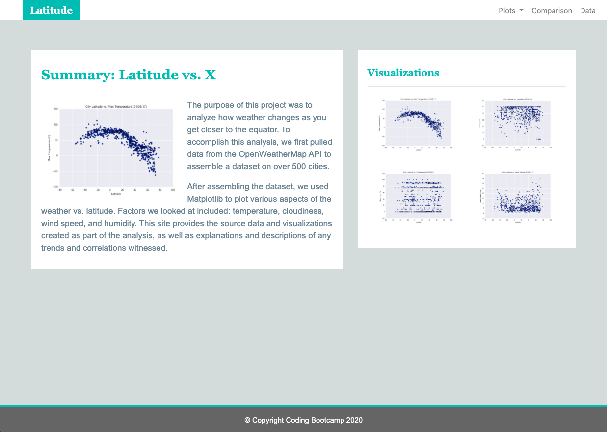
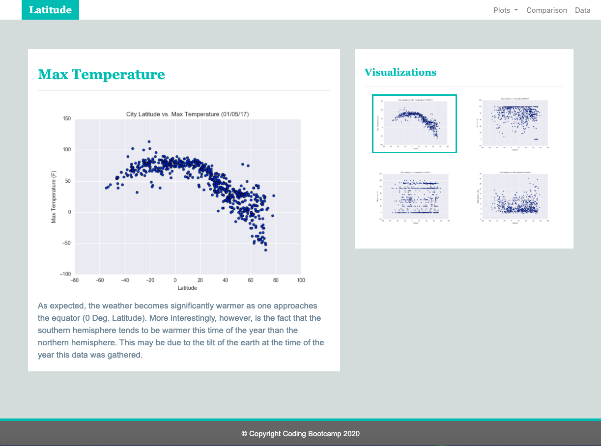
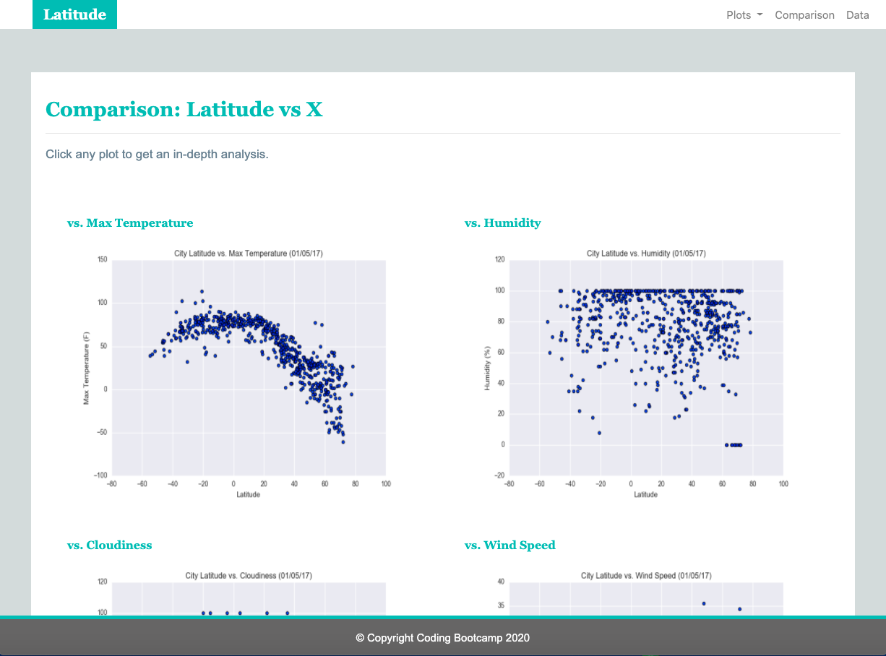
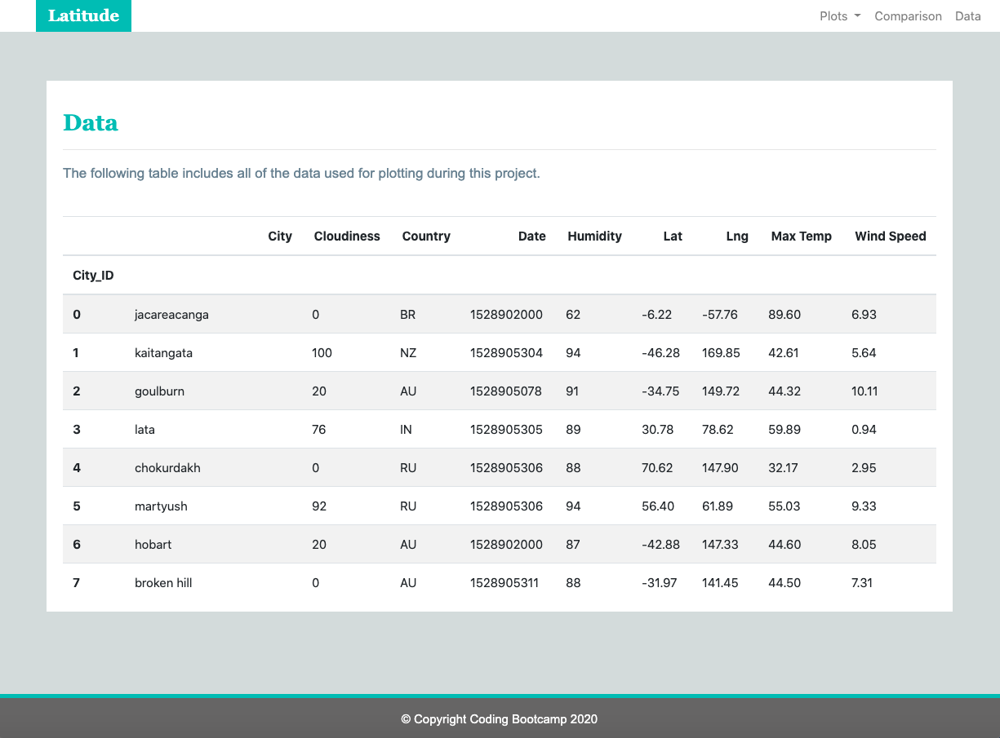
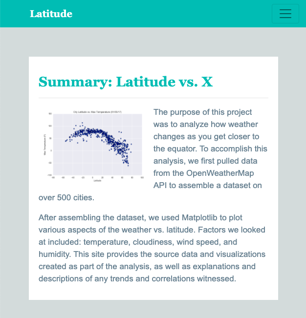

# Project: Weather Analysis Visualization Website

## Objective
Create a visualization dashboard website using visualizations  plotting weather data.

Create individual pages for each plot and naviagtion between them. These pages will contain the visualizations and their corresponding explanations. 

## Tools
* HTML
* CSS
* Bootstrap

## Assignment:
The website consists of 7 pages total, including:

<strong>Landing page:</strong>  
* An explanation of the project
* Links to each visualizations page
* Four visualization pages, each with:
    * A descriptive title and heading tag
    * The plot/visualization itself for the selected comparison
    * A paragraph describing the plot and its significance

<strong>"Comparisons" page:</strong>  
* Contains all of the visualizations on the same page
* Uses a bootstrap grid for the visualizations

<strong>"Data" page:</strong>  
* Display a responsive table containing the data used in the visualizations
* The table must be a bootstrap table component and converted into HTML

<strong>Navigation menu:</strong>  

* Site name on the left of the nav which allows users to return to the landing page from any page
* Contains a dropdown on the right of the navbar named "Plots" which provides links to each individual visualization page
* Provides two more links on the right: "Comparisons" which links to the comparisons page, and "Data" which links to the data page
* Responsive for different devices using media queries

## Sample Screenshots

### Index Page

### Plot Page

### Comparison Page

### Data Page

### Index Page - Small

